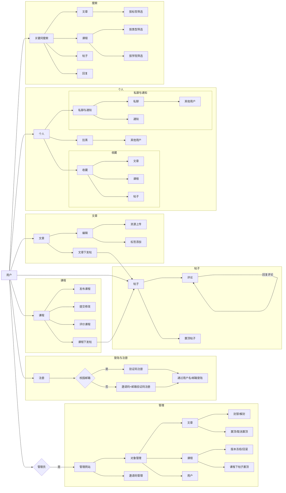

### 功能示意  

```mermaid
graph LR;
    A[用户] --> AA[注册]
    subgraph LOGIN[登陆与注册]
      direction RL
        AA --> B{校园邮箱};
        B -->|是| C[验证码注册];
        B -->|否| D[邀请码+邮箱验证码注册];
        C --> E[通过用户名/邮箱登陆]
        D --> E
    end

    A --> J{管理员}
    J --> |是| JA[管理网站]
    subgraph MANAGE[管理]
    direction RL
        JA --> JAA[对象管理]
        JAA --> JAAA[文章]
        JAAA --> JAAAA[封禁/解封]
        JAAA --> JAAAB[置顶/取消置顶]
        JAA --> JAAB[课程]
        JAAB --> JAABA[版本冻结/回滚]
        JAAB --> JAABB[课程下帖子置顶]  
        JAA --> JAAC[用户]
        JA --> JAB[邀请码管理]
    end
    A --> H[帖子]  
    subgraph POST[帖子]
        direction RL
            H --> HA[评论]  
            HA --> |回复评论|HA  
            H --> HB[置顶帖子]  
        end
    A --> F[文章]
    subgraph ARTICLE[文章]
        direction RL
        F --> FA[编辑]  
        FA --> FAA[资源上传]  
        FA --> FAB[标签添加]  
        F --> FB[文章下发帖]    
        FB --> H  
    end
    A --> G[课程] 
    subgraph COURSE[课程]
        direction RL
        G --> GA[发布课程]   
        G --> GB[提交修改]    
        G --> GC[评价课程]  
        G --> GD[课程下发帖]
        GD --> H  
    end  
    A -->K[个人]  
    subgraph PERSONAL[个人]
        direction RL
        K --> KA[收藏]  
        subgraph COLLECTION[收藏]
            direction RL
            KA --> KAA[文章]
            KA --> LAB[课程]
            KA --> KAC[帖子]
        end 
        K --> KB[私聊与通知]  
        subgraph CHAT[私聊与通知]
            direction RL
            KB --> KBA[私聊]  --> KBAA[其他用户]  
            KB --> KBB[通知] 
        end 
        K --> KC[拉黑] --> KCA[其他用户]
    end
    A --> AB[关键词搜索]  
    subgraph SEARCH[搜索]
        direction RL  

            AB --> ABC[文章] --> ABCA[按标签筛选] 
            AB --> ABD[课程] --> ABDA[按类型筛选]  
            ABD --> ABDB[按学院筛选] 
            AB --> ABE[帖子]
            AB --> ABF[回复]
    end
```