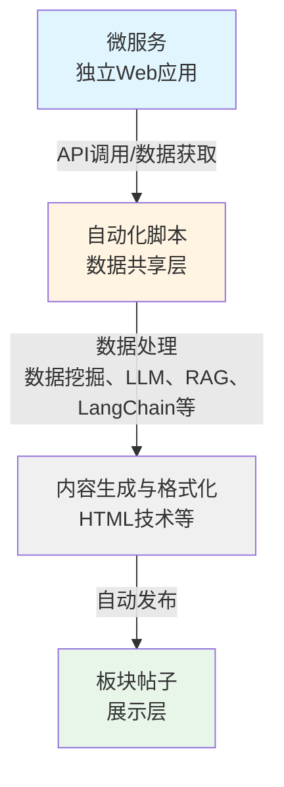
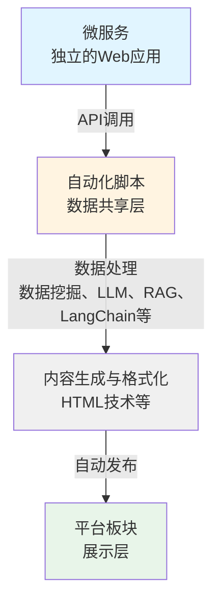
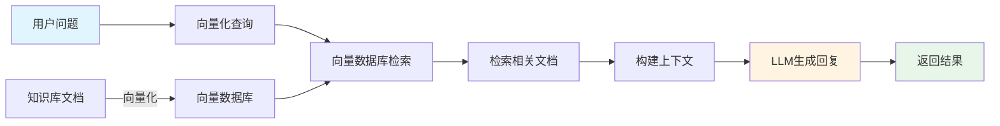
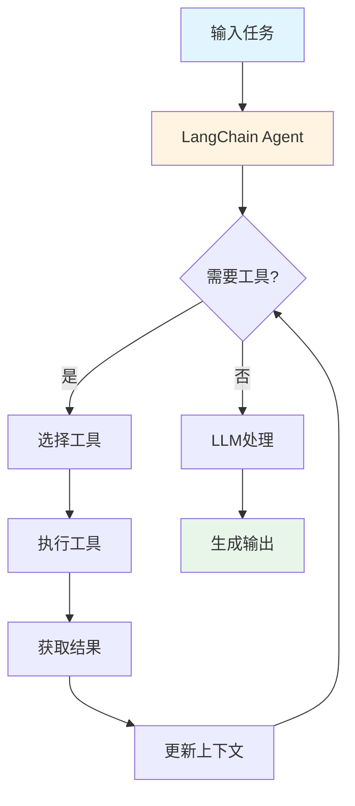
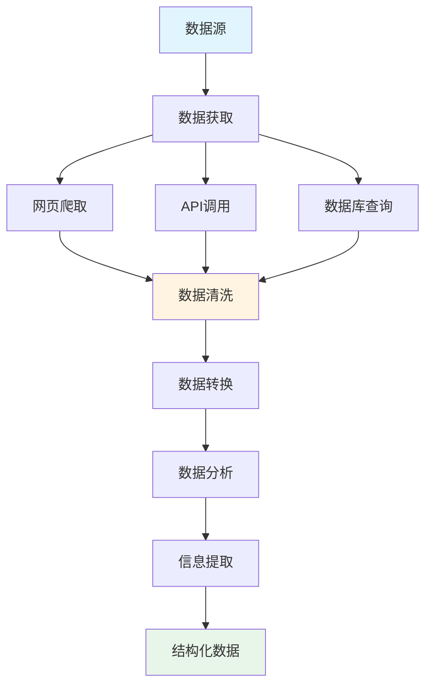

# 自动化脚本开发指南

## 技术栈

自动化脚本开发可以使用任何编程语言和技术栈：

- **Python**：适合数据处理和自动化任务，丰富的 AI 模型库（如 OpenAI、LangChain、RAG 框架等）
- **Node.js**：适合 Web 应用和 API 调用
- **Java**：适合企业级应用
- **其他语言**：根据需求选择合适的语言

## 自动化脚本的作用

自动化脚本是数据共享的手段，用于将内容集成到平台，方便用户使用和信息获取，以及提高开发者的微服务使用数。

## 核心技术能力

自动化脚本可以结合以下技术实现适配平台的智能服务：

### 1. 大语言模型（LLM）
- **OpenAI GPT**：通过 OpenAI API 接入 GPT-3.5、GPT-4 等模型
- **Claude**：通过 Anthropic API 接入 Claude 模型
- **本地模型**：使用本地部署的开源模型（如 Llama、ChatGLM、Qwen 等）
- **其他模型**：根据需求选择合适的模型

### 2. RAG（检索增强生成）
- **向量数据库**：使用 Chroma、Pinecone、Weaviate 等向量数据库存储知识库
- **文档检索**：从知识库中检索相关信息，增强生成内容的准确性
- **上下文增强**：基于检索到的信息生成更准确的回复

### 3. LangChain
- **应用链构建**：使用 LangChain 构建复杂的多步骤处理流程
- **工具调用**：集成各种工具（搜索、计算、API 调用等）
- **记忆管理**：管理对话历史和上下文信息
- **Agent 框架**：使用 LangChain 的 Agent 框架实现复杂的决策流程

### 4. 数据挖掘
- **网页爬取**：使用 BeautifulSoup、Scrapy 等工具从网页提取数据
- **数据清洗**：清洗和处理获取的原始数据
- **数据分析**：使用 pandas、numpy 等工具进行数据分析
- **信息提取**：从非结构化数据中提取结构化信息

### 5. HTML 技术
- **自定义样式**：使用 HTML/CSS 实现丰富的视觉效果
- **交互功能**：实现交互式的内容展示
- **响应式设计**：适配 PC 端和移动端显示

## 数据流设计

### 微服务-自动化脚本-板块帖子的数据流

自动化脚本在微服务和平台之间起到数据共享层的作用，数据流设计如下：



**数据流说明**：
1. **数据获取**：自动化脚本从微服务 API、网页、数据库等数据源获取数据
2. **数据处理**：使用数据挖掘、LLM、RAG、LangChain 等技术处理数据
3. **内容生成**：生成帖子内容，可以使用 HTML 技术优化展示
4. **自动发布**：通过平台 API 发布到指定板块

**共享机制**：
- 微服务可以独立运行，提供 Web 应用服务
- 自动化脚本作为可选的数据共享层，将微服务内容集成到平台
- 板块作为展示层，展示自动化脚本发布的内容
- 板块一般与微服务对应，但这种对应关系不是必须的

## 结合微服务开发（推荐）

如果您已经开发了微服务，可以开发自动化脚本将微服务内容集成到平台，提高微服务的使用数。

### 开发模式

1. **先开发微服务**：开发微服务，提供独立的 Web 应用
2. **再开发自动化脚本**：开发自动化脚本，调用微服务 API，使用大模型、RAG、LangChain、数据挖掘等技术处理，使用 HTML 技术优化展示，自动发布到平台

### 架构示例



### 优势

- **提高使用数**：通过平台展示，提高微服务的使用数和用户访问量
- **方便用户**：方便用户使用和信息获取
- **自动化**：自动发布内容，减少手动操作
- **智能化**：结合 AI 技术提供更智能的服务

## 技术集成示例

### 大语言模型（LLM）集成

自动化脚本可以接入大语言模型（LLM）提供智能服务：

- **OpenAI GPT**：通过 OpenAI API 接入 GPT-3.5、GPT-4 等模型
- **Claude**：通过 Anthropic API 接入 Claude 模型
- **本地模型**：使用本地部署的开源模型（如 Llama、ChatGLM、Qwen 等）
- **其他模型**：根据需求选择合适的模型

#### LLM 应用场景

- **内容生成**：使用 LLM 生成帖子、文章内容
- **智能回复**：使用 LLM 理解评论并生成回复
- **信息提取**：使用 LLM 从文本中提取关键信息
- **内容总结**：使用 LLM 总结长文本内容
- **多语言处理**：使用 LLM 进行翻译和多语言处理

#### LLM 集成示例

```python
# 示例：使用 OpenAI API 生成回复
import openai

def generate_reply(comment_text, post_context):
    response = openai.ChatCompletion.create(
        model="gpt-3.5-turbo",
        messages=[
            {"role": "system", "content": "你是一个友好的校园助手，帮助回答学生问题。"},
            {"role": "user", "content": f"帖子内容：{post_context}\n评论：{comment_text}\n请生成一个合适的回复。"}
        ]
    )
    return response.choices[0].message.content
```

### RAG（检索增强生成）集成

RAG 技术可以结合向量数据库和知识库，提供基于上下文的智能问答和信息检索。

#### RAG 工作流程



#### RAG 应用场景

- **知识库问答**：基于平台文档、政策文件等提供问答服务
- **上下文增强回复**：基于检索到的信息生成更准确的回复
- **信息检索**：从大量文档中检索相关信息

#### RAG 集成示例

```python
# 示例：使用 LangChain + Chroma 实现 RAG
from langchain.vectorstores import Chroma
from langchain.embeddings import OpenAIEmbeddings
from langchain.chains import RetrievalQA
from langchain.llms import OpenAI

# 1. 创建向量数据库
embeddings = OpenAIEmbeddings()
vectorstore = Chroma.from_documents(documents, embeddings)

# 2. 创建检索链
qa_chain = RetrievalQA.from_chain_type(
    llm=OpenAI(),
    chain_type="stuff",
    retriever=vectorstore.as_retriever()
)

# 3. 使用 RAG 生成回复
def generate_rag_reply(question, context):
    result = qa_chain.run(question)
    return result
```

### LangChain 集成

LangChain 可以帮助构建复杂的 AI 应用链，实现多步骤的智能处理流程。

#### LangChain 工作流程



#### LangChain 应用场景

- **多步骤处理**：构建复杂的多步骤处理流程
- **工具调用**：集成各种工具（搜索、计算、API 调用等）
- **记忆管理**：管理对话历史和上下文信息
- **Agent 框架**：实现复杂的决策流程

#### LangChain 集成示例

```python
# 示例：使用 LangChain 构建处理链
from langchain.llms import OpenAI
from langchain.chains import LLMChain
from langchain.prompts import PromptTemplate
from langchain.agents import initialize_agent, Tool

# 1. 创建工具
tools = [
    Tool(
        name="搜索工具",
        func=search_function,
        description="用于搜索相关信息"
    ),
    Tool(
        name="计算工具",
        func=calculate_function,
        description="用于执行计算"
    )
]

# 2. 创建 Agent
agent = initialize_agent(
    tools,
    OpenAI(temperature=0),
    agent="zero-shot-react-description",
    verbose=True
)

# 3. 使用 Agent 处理任务
result = agent.run("根据天气数据生成友好的天气提醒")
```

### 数据挖掘集成

数据挖掘技术可以从网页、API、数据库等数据源提取和处理信息。

#### 数据挖掘工作流程



#### 数据挖掘应用场景

- **网页数据提取**：从网页中提取结构化数据
- **数据清洗与处理**：清洗和处理获取的原始数据
- **数据分析**：对数据进行统计分析和挖掘
- **信息提取**：从非结构化数据中提取结构化信息

#### 数据挖掘集成示例

```python
# 示例：使用数据挖掘技术提取网页信息
import requests
from bs4 import BeautifulSoup
import pandas as pd

def extract_web_data(url):
    # 1. 获取网页内容
    response = requests.get(url)
    soup = BeautifulSoup(response.content, 'html.parser')
    
    # 2. 提取数据
    data = []
    for item in soup.find_all('div', class_='news-item'):
        title = item.find('h3').text
        content = item.find('p').text
        data.append({'title': title, 'content': content})
    
    # 3. 数据处理
    df = pd.DataFrame(data)
    # 进行数据清洗和分析
    
    return df
```

### HTML 技术集成

HTML 技术可以用于创建丰富的交互式内容展示。

#### HTML 应用场景

- **自定义样式**：使用 HTML/CSS 实现丰富的视觉效果
- **交互功能**：实现交互式的内容展示
- **响应式设计**：适配 PC 端和移动端显示

#### HTML 帖子示例

```python
# 示例：生成 HTML 帖子
def generate_html_post(data):
    html_content = f"""
    <div style="max-width: 700px; margin: 0 auto;">
        <h2>{data['title']}</h2>
        <div class="content">
            {data['content']}
        </div>
        <div class="interactive-chart">
            <!-- 交互式图表 -->
        </div>
    </div>
    <style>
        .content {{
            padding: 20px;
            background: #f5f5f5;
        }}
        @media (max-width: 768px) {{
            div {{
                max-width: 98vw;
            }}
        }}
    </style>
    """
    return f"SELF-DEFINE-HTML{html_content}"
```

### 完整技术集成示例

```python
# 示例：结合天气微服务开发自动化脚本（完整服务体系）
# 结合大模型、RAG、LangChain、数据挖掘、HTML等技术
import requests
import openai
from langchain.llms import OpenAI
from langchain.chains import LLMChain
from langchain.prompts import PromptTemplate
from datetime import datetime, timedelta
import pandas as pd

def weather_automation_script():
    """
    完整的天气服务自动化脚本示例
    结合了数据挖掘、LLM、HTML等技术
    """
    # 1. 数据获取：调用微服务获取天气数据
    weather_data = requests.get('https://your-microservice.com/api/weather').json()
    
    # 2. 数据挖掘：分析天气趋势
    df = pd.DataFrame(weather_data['forecast'])
    trend_analysis = analyze_weather_trend(df)
    
    # 3. LLM 处理：使用大模型生成友好的天气提醒
    prompt = f"""
    根据以下天气数据，生成一份友好的天气提醒：
    当前温度：{weather_data['temperature']}°C
    天气状况：{weather_data['condition']}
    趋势分析：{trend_analysis}
    
    请生成一份温馨、友好的天气提醒，包含穿衣建议和出行建议。
    """
    analysis = openai.ChatCompletion.create(
        model="gpt-3.5-turbo",
        messages=[{"role": "user", "content": prompt}]
    ).choices[0].message.content
    
    # 4. HTML 技术：生成美观的 HTML 帖子
    html_content = generate_weather_html(weather_data, analysis)
    
    # 5. 发布到板块
    post_id = post_to_section(
        section_id=123,  # 天气板块 ID
        title="今日天气提醒",
        content=f"SELF-DEFINE-HTML{html_content}"
    )
    
    # 6. 数据生命周期管理：删除过时的帖子
    delete_old_posts(section_id=123, older_than_hours=24)
    
    return post_id

def analyze_weather_trend(df):
    """数据挖掘：分析天气趋势"""
    # 使用 pandas 进行数据分析
    avg_temp = df['temperature'].mean()
    temp_change = df['temperature'].iloc[-1] - df['temperature'].iloc[0]
    return f"平均温度：{avg_temp}°C，温度变化：{temp_change}°C"

def generate_weather_html(weather_data, analysis):
    """HTML 技术：生成美观的 HTML 帖子"""
    return f"""
    <div style="max-width: 700px; margin: 0 auto; padding: 20px; font-family: Arial, sans-serif;">
        <div style="background: linear-gradient(135deg, #667eea 0%, #764ba2 100%); 
                    color: white; padding: 20px; border-radius: 10px; margin-bottom: 20px;">
            <h2 style="margin: 0;">今日天气</h2>
            <div style="font-size: 48px; margin: 10px 0;">
                {weather_data['temperature']}°C
            </div>
            <div>{weather_data['condition']}</div>
        </div>
        <div style="background: #f5f5f5; padding: 20px; border-radius: 10px;">
            <h3>温馨提示</h3>
            <p>{analysis}</p>
        </div>
    </div>
    <style>
        @media (max-width: 768px) {{
            div {{
                max-width: 98vw;
            }}
        }}
    </style>
    """

def delete_old_posts(section_id, older_than_hours):
    """删除指定板块中超过指定时间的帖子"""
    cutoff_time = datetime.now() - timedelta(hours=older_than_hours)
    
    # 获取板块中的帖子列表
    posts = get_section_posts(section_id)
    
    for post in posts:
        post_time = datetime.fromisoformat(post['publish_time'])
        if post_time < cutoff_time:
            # 删除过时的帖子
            delete_post(post['id'])
            print(f"已删除过时帖子：{post['id']}")
```

### 板块关系

板块一般与微服务对应，但这种对应关系不是必须的。自动化脚本可以：

- **监控板块**：选择监控某一个板块下的帖子/回复进行回复/处理
- **集成信息**：集成其他网站的信息到此板块
- **其他形式**：以其他形式（如课程/文章）发布到平台

### 结合微服务开发建议

1. **微服务先行**：先开发稳定的微服务，提供独立的 Web 应用
2. **选择板块**：选择对应的板块（可以与微服务对应，但不是必须的）
3. **自动化脚本开发**：开发自动化脚本，调用微服务 API，使用大模型、RAG、LangChain、数据挖掘等技术处理，使用 HTML 技术优化展示，自动发布到板块
4. **数据管理**：对于实时性强的服务，实现自动删除过时内容的机制，避免无用数据堆积

### 数据生命周期管理

对于实时性较强的服务，必须实现内容生命周期管理：

```python
# 示例：内容生命周期管理
def manage_content_lifecycle(section_id, max_age_hours=24):
    """管理板块内容的生命周期"""
    # 1. 获取板块中的帖子
    posts = get_section_posts(section_id)
    
    # 2. 删除过时的帖子
    cutoff_time = datetime.now() - timedelta(hours=max_age_hours)
    for post in posts:
        if datetime.fromisoformat(post['publish_time']) < cutoff_time:
            delete_post(post['id'])
    
    # 3. 删除过时的评论（可选）
    for post in posts:
        comments = get_post_comments(post['id'])
        for comment in comments:
            if datetime.fromisoformat(comment['publish_time']) < cutoff_time:
                delete_comment(comment['id'])
```

**重要提示**：
- 对于实时性强的服务（天气、课程表、政策通知等），必须实现自动删除机制
- 根据内容类型设置合理的保留时间（如天气信息保留 24 小时，课程表保留一周）
- 定期清理过时内容，避免平台积累大量无用数据

## 开发要求

### 基本要求

1. **接口调用**：使用平台提供的 API 接口
2. **错误处理**：实现完善的错误处理和重试机制
3. **日志记录**：记录运行日志，便于问题排查
4. **频率控制**：控制接口调用频率，避免频繁请求

### 代码规范

1. **代码质量**：确保代码正确性和稳定性
2. **注释说明**：添加必要的代码注释
3. **文档完善**：提供功能说明和使用文档
4. **源代码审查**：必须提交源代码供审查

## 接口使用

### 获取接口文档

联系管理员获取最新的 API 文档，包括：

- 认证接口
- 帖子发布接口
- 回复接口
- 板块管理接口

### 接口调用示例

```python
# 示例：发布帖子
import requests

# 认证获取 token
auth_response = requests.post('https://api.example.com/auth', {
    'username': 'agent_account',
    'password': 'password'
})
token = auth_response.json()['token']

# 发布帖子
headers = {'Authorization': f'Bearer {token}'}
post_data = {
    'title': '帖子标题',
    'content': '帖子内容',
    'section_id': 123
}
response = requests.post('https://api.example.com/post/create', 
                        json=post_data, 
                        headers=headers)
```

## 内容格式

### 普通文本帖子

标准的文本格式，支持：

- 文本内容
- 图片（使用 `[图片URL]` 格式）
- 链接识别

### HTML 帖子

使用 HTML 格式优化展示：

- 格式：`SELF-DEFINE-HTML{HTML内容}`
- 支持自定义样式和交互
- PC 端最佳宽度 700px，移动端最佳宽度 98vw

参考平台适配开发指南了解详细的帖子格式说明。

## 频率控制

### 调用频率建议

- **发布帖子**：建议间隔不少于 5 分钟
- **回复评论**：建议间隔不少于 1 分钟
- **数据获取**：根据数据更新频率合理设置

### 实现方式

```python
import time
from datetime import datetime, timedelta

class RateLimiter:
    def __init__(self, min_interval_seconds=300):
        self.min_interval = min_interval_seconds
        self.last_call_time = None
    
    def wait_if_needed(self):
        if self.last_call_time:
            elapsed = (datetime.now() - self.last_call_time).total_seconds()
            if elapsed < self.min_interval:
                wait_time = self.min_interval - elapsed
                time.sleep(wait_time)
        self.last_call_time = datetime.now()
```

## 错误处理

### 异常处理

```python
import requests
import time

def post_with_retry(url, data, headers, max_retries=3):
    for attempt in range(max_retries):
        try:
            response = requests.post(url, json=data, headers=headers, timeout=10)
            if response.status_code == 200:
                return response
            elif response.status_code == 429:  # 频率限制
                time.sleep(60)  # 等待1分钟
            else:
                raise Exception(f"HTTP {response.status_code}: {response.text}")
        except Exception as e:
            if attempt == max_retries - 1:
                raise
            time.sleep(2 ** attempt)  # 指数退避
    return None
```

### 日志记录

```python
import logging

logging.basicConfig(
    level=logging.INFO,
    format='%(asctime)s - %(name)s - %(levelname)s - %(message)s',
    handlers=[
        logging.FileHandler('agent.log'),
        logging.StreamHandler()
    ]
)

logger = logging.getLogger('agent')
logger.info('Agent started')
logger.error('Error occurred: %s', error_message)
```

## 部署建议

### 运行环境

- **服务器部署**：在稳定的服务器上运行
- **定时任务**：使用 cron、systemd timer 等定时执行
- **进程管理**：使用 supervisor、pm2 等管理进程

### 监控告警

- 监控 Agent 运行状态
- 设置异常告警
- 定期检查日志

## 代码审查

### 提交要求

提交 Agent 源代码时，请包含：

1. **源代码文件**：完整的源代码
2. **配置文件**：配置文件（不含敏感信息）
3. **说明文档**：功能说明、使用方法、依赖项
4. **运行日志**：测试运行日志（可选）

### 审查内容

- 代码正确性和稳定性
- 接口调用频率是否合理
- 错误处理是否完善
- 内容是否符合规范

## 注意事项

1. **账号安全**：妥善保管自动化脚本账号信息
2. **内容质量**：确保发布内容有用、准确
3. **频率控制**：避免频繁调用接口
4. **及时更新**：保持自动化脚本功能的时效性
5. **遵守规范**：严格遵守平台开发规范
6. **技术选择**：根据实际需求选择合适的技术组合，避免过度复杂化
7. **成本控制**：使用大模型 API 时注意控制成本，合理使用本地模型

## 技术资源

### 推荐学习资源

- **LangChain 文档**：https://python.langchain.com/
- **RAG 教程**：检索增强生成相关教程和最佳实践
- **数据挖掘工具**：BeautifulSoup、Scrapy、pandas 等
- **大模型 API**：OpenAI、Anthropic、本地模型部署等

## 联系方式

- **管理员邮箱**：admin@sharesdu.com
- **QQ群**：246680702
