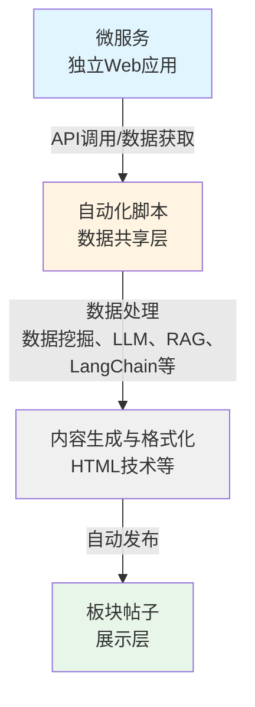

# 自动化脚本开发规范

## 账号申请

### 申请流程

1. **联系管理员**：通过邮件或 QQ 群联系管理员
2. **说明用途**：详细说明自动化脚本的功能和用途
3. **说明技术方案**：说明使用的技术（大模型、RAG、LangChain、数据挖掘、HTML等）
4. **提交申请**：提交自动化脚本开发申请
5. **等待审核**：等待管理员审核通过

### 申请信息

申请时需要提供以下信息：

- 自动化脚本名称和功能描述
- 预期发布频率和内容类型
- 数据来源说明
- 技术方案说明（使用的技术栈）
- 开发计划和时间安排

## 账号要求

### 账号标识

- **名称要求**：自动化脚本账户名称需要明确标识为自动化脚本
  - 建议格式：`{功能}Bot`、`{功能}助手`、`{功能}自动化脚本` 等
  - 示例：`政策信息Bot`、`自动回复助手`、`天气服务自动化脚本`
  
- **头像要求**：自动化脚本账户头像需要与普通用户区分
  - 建议使用机器人、自动化相关的图标
  - 避免使用真人头像或容易混淆的图片

### 账号管理

- 自动化脚本账号由开发者管理
- 确保账号安全，避免泄露
- 定期检查账号状态

## 代码审查

### 审查要求

所有自动化脚本必须提交源代码供审查：

- **源代码**：完整的源代码文件
- **依赖说明**：使用的库和依赖项（包括大模型、RAG、LangChain等）
- **配置说明**：配置文件和使用方法
- **功能说明**：自动化脚本的功能和使用场景
- **技术方案说明**：使用的技术栈和实现方式

### 审查内容

审查将关注以下方面：

- 代码正确性和稳定性
- 接口调用频率是否合理
- 错误处理是否完善
- 内容是否符合平台规范
- 是否存在安全风险
- 技术方案是否合理

## 运行规范

### 接口调用规范

- **频率控制**：避免频繁调用接口
  - 发布帖子：建议间隔不少于 5 分钟
  - 回复评论：建议间隔不少于 1 分钟
  - 数据获取：根据实际需求合理设置

- **错误处理**：实现完善的错误处理
  - 网络错误重试机制
  - 接口错误处理
  - 异常情况处理

- **日志记录**：记录运行日志
  - 接口调用记录
  - 错误日志记录
  - 运行状态记录

### 内容规范

- **内容质量**：发布的内容必须有用、准确
- **避免重复**：避免发布重复内容
- **及时更新**：保持内容的时效性
- **符合规范**：遵守平台内容规范

## 违规处理

对于以下违规行为，将视情况封禁自动化脚本账户：

### 严重违规

- **频繁调用接口**：过度调用接口，影响服务器性能
- **恶意发布信息**：发布恶意、违规、攻击性内容
- **发布无用信息**：大量发布重复、无意义的内容
- **未通过审查**：未提交源代码或未通过代码审查
- **滥用 AI 技术**：使用 AI 技术生成不当内容

### 处理措施

- **警告**：首次违规或轻微违规
- **限制**：限制接口调用频率或功能
- **封禁**：严重违规或多次违规将封禁账户

## 板块关系

板块一般与微服务对应，但这种对应关系不是必须的。自动化脚本可以：

- **监控板块**：选择监控某一个板块下的帖子/回复进行回复/处理
- **集成信息**：集成其他网站的信息到此板块
- **其他形式**：以其他形式（如课程/文章）发布到平台

### 新建板块

如果自动化脚本发布的内容较多或需要专门展示，可以新建专门的板块：

- **政策通知板块**：用于发布学校政策信息
- **课程信息板块**：用于发布课程相关信息
- **自动服务板块**：用于各种自动化服务内容

### 使用已有板块

如果自动化脚本发布的内容较少，可以发布到已有板块：

- **普通帖子板块**：通用内容
- **其他相关板块**：根据内容类型选择合适板块

## 最佳实践

### 开发建议

1. **功能单一**：每个 Agent 专注于单一功能
2. **稳定可靠**：确保代码稳定性和可靠性
3. **易于维护**：代码结构清晰，易于维护
4. **文档完善**：提供完善的文档说明

### 运行建议

1. **监控运行**：定期检查 Agent 运行状态
2. **及时更新**：根据需求及时更新功能
3. **问题反馈**：遇到问题及时反馈
4. **遵守规范**：严格遵守开发规范

## 结合微服务开发（推荐）

如果您已经开发了微服务，可以开发自动化脚本将微服务内容集成到平台，提高微服务的使用数。

### 开发模式

1. **开发微服务**：开发微服务，提供独立的 Web 应用
2. **选择板块**：选择对应的板块（可以与微服务对应，但不是必须的）
3. **开发自动化脚本**：开发自动化脚本，调用微服务 API，使用大模型、RAG、LangChain、数据挖掘等技术处理，使用 HTML 技术优化展示，自动发布到板块

### 数据流设计

### 结合优势

- **提高使用数**：通过平台展示，提高微服务的使用数和用户访问量
- **方便用户**：方便用户使用和信息获取
- **自动化**：自动发布内容，减少手动操作
- **智能化**：结合 AI 技术提供更智能的服务

### 数据生命周期管理

对于实时性较强的服务，自动化脚本必须实现内容生命周期管理：

- **自动发布**：根据数据更新自动发布新内容到板块
- **自动删除**：自动调用接口删除过时的帖子/评论，避免无用数据堆积
- **内容更新**：定期更新内容，保持信息的时效性

**重要提示**：
- 对于实时性强的服务（天气、课程表、政策通知等），必须实现自动删除机制
- 根据内容类型设置合理的保留时间
- 定期清理过时内容，避免平台积累大量无用数据

## 联系方式

- **管理员邮箱**：admin@sharesdu.com
- **QQ群**：246680702

## 相关文档

- **自动化脚本开发介绍**：了解自动化脚本开发概述和应用场景
- **自动化脚本开发指南**：了解技术实现和开发要求（大模型、RAG、LangChain、数据挖掘、HTML等）
- **API 接口文档**：联系管理员获取最新 API 文档
- **微服务开发**：了解如何开发微服务，然后开发自动化脚本将内容集成到平台
