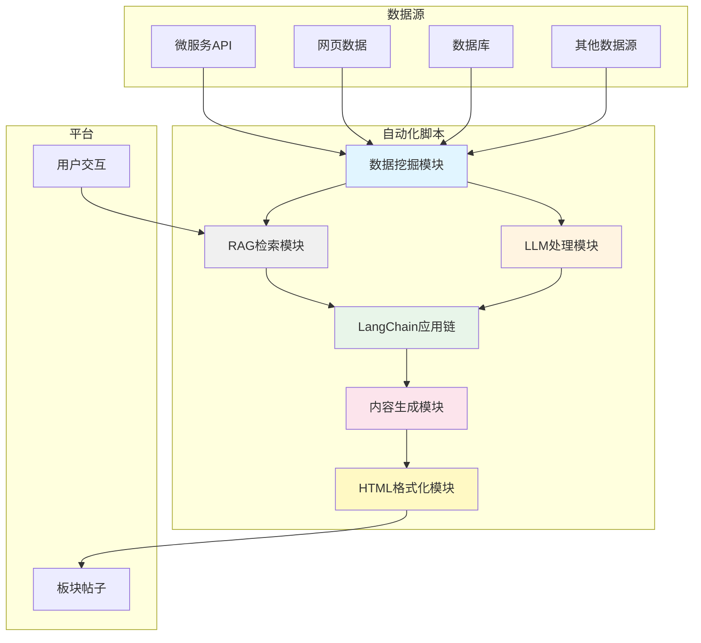
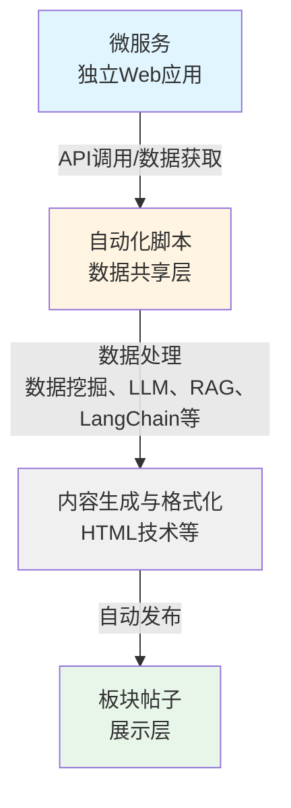

# 自动化脚本开发 - 介绍

## 概述

自动化脚本（Agent，自动发布帖子程序）是数据共享的手段，用于将内容集成到平台，方便用户使用和信息获取，以及提高开发者的微服务使用数。

自动化脚本可以结合多种先进技术，实现适配平台的智能服务：

- **大语言模型（LLM）**：接入 GPT、Claude、本地模型等，提供智能回复、内容生成、信息提取等能力
- **RAG（检索增强生成）**：结合向量数据库和知识库，提供基于上下文的智能问答和信息检索
- **LangChain**：使用 LangChain 框架构建复杂的 AI 应用链，实现多步骤的智能处理流程
- **数据挖掘**：从网页、API、数据库等数据源提取和处理信息，进行数据分析和挖掘
- **HTML 技术**：使用 HTML 帖子格式，实现丰富的交互式内容展示和自定义样式

通过这些技术的结合，自动化脚本可以构建出功能强大、智能化的平台适配服务。

### 技术架构图

## 自动化脚本的作用

自动化脚本的主要作用是：

- **数据共享**：将微服务或其他数据源的内容集成到平台
- **内容集成**：方便用户使用和信息获取
- **提高使用数**：通过平台展示，提高微服务的使用数和用户访问量
- **自动化服务**：自动发布帖子、回复信息等操作
- **智能处理**：结合 AI 技术，提供智能化的内容生成、分析和处理能力

## 核心功能

### 自动发布内容

自动化脚本可以通过平台接口自动发布帖子，包括：

- **普通文本帖子**：标准的文本格式帖子
- **HTML 帖子**：使用 HTML 技术自定义样式和交互，优化展示效果，支持响应式设计

### 智能回复

自动化脚本可以自动对帖子下的新增评论进行回复，可以结合以下技术提供智能回复：

- **大语言模型**：使用 LLM 理解上下文并生成自然语言回复
- **RAG 技术**：基于知识库检索相关信息，生成更准确的回复
- **LangChain**：构建多步骤的回复生成流程，实现复杂的对话逻辑

### 数据获取与处理

自动化脚本可以从多种数据源获取信息，处理后发布到平台：

- **网页爬取**：使用数据挖掘技术从学校官网、新闻网站等获取信息
- **API 调用**：调用微服务 API、第三方 API 获取数据
- **数据库查询**：从数据库提取和处理数据
- **数据挖掘与分析**：对获取的数据进行挖掘、分析和处理

### 技术集成能力

自动化脚本可以结合多种技术，实现强大的功能：

#### 大语言模型（LLM）集成
- **智能内容生成**：使用 LLM 生成高质量内容
- **智能回复**：使用 LLM 理解上下文并生成回复
- **信息提取与总结**：使用 LLM 提取和总结信息
- **多语言支持**：使用 LLM 进行多语言处理

#### RAG（检索增强生成）集成
- **知识库检索**：结合向量数据库，从知识库中检索相关信息
- **上下文增强**：基于检索到的信息生成更准确的回复
- **文档问答**：基于平台文档、政策文件等提供问答服务

#### LangChain 集成
- **应用链构建**：使用 LangChain 构建复杂的多步骤处理流程
- **工具调用**：集成各种工具（搜索、计算、API 调用等）
- **记忆管理**：管理对话历史和上下文信息

#### 数据挖掘集成
- **网页数据提取**：从网页中提取结构化数据
- **数据清洗与处理**：清洗和处理获取的原始数据
- **数据分析**：对数据进行统计分析和挖掘

#### HTML 技术集成
- **自定义样式**：使用 HTML/CSS 实现丰富的视觉效果
- **交互功能**：实现交互式的内容展示
- **响应式设计**：适配 PC 端和移动端显示

## 应用场景

### 1. 集成微服务内容

将微服务的内容集成到平台，提高微服务的使用数：

- **天气服务自动化脚本**：从天气微服务获取数据，使用数据挖掘技术分析天气趋势，结合 LLM 生成友好的天气提醒，自动发布每日天气信息到平台
- **二手市场自动化脚本**：从二手市场微服务获取商品数据，使用数据挖掘技术分析热门商品，结合 HTML 技术优化商品展示，自动发布热门商品信息
- **搭子寻找自动化脚本**：从搭子寻找微服务获取匹配数据，使用 LLM 生成匹配推荐说明，自动发布匹配信息
- **其他微服务自动化脚本**：根据微服务功能，开发相应的自动化脚本将内容集成到平台

### 2. 监控板块并处理

监控某个板块下的帖子/回复进行回复/处理：

- **智能回复自动化脚本**：监控指定板块或帖子的新评论，使用 LLM + RAG 技术，基于知识库检索相关信息，生成智能回复
- **内容审核自动化脚本**：监控板块内容，使用 LLM 进行内容审核，自动处理违规或不当内容
- **信息聚合自动化脚本**：监控板块内容，使用数据挖掘技术聚合和整理相关信息，使用 LangChain 构建信息处理流程

### 3. 集成其他网站信息

集成其他网站的信息到平台板块：

- **学校政策信息自动化脚本**：使用数据挖掘技术从学校官网获取最新政策信息，使用 LLM 提取关键信息并生成摘要，发布到"政策通知"板块
- **课程信息同步自动化脚本**：从教务系统获取课程信息，使用数据挖掘技术处理课程数据，结合 HTML 技术优化课程展示，发布到"课程信息"板块
- **新闻聚合自动化脚本**：从多个新闻源获取信息，使用数据挖掘技术进行新闻聚合和分类，使用 LLM 生成新闻摘要，发布到相应板块

### 4. 其他形式的内容发布

以其他形式（如课程/文章）发布到平台：

- **课程发布自动化脚本**：使用 LLM 生成课程介绍，结合 HTML 技术优化课程展示，自动发布课程信息到平台
- **文章同步自动化脚本**：从其他平台同步文章内容，使用数据挖掘技术提取文章信息，使用 LLM 进行内容优化
- **内容生成自动化脚本**：使用 LLM + RAG 技术，基于知识库生成高质量内容并发布

## 数据流设计

### 微服务-自动化脚本-板块帖子的数据流

自动化脚本在微服务和平台之间起到数据共享层的作用，数据流设计如下：

**数据流说明**：
1. **数据获取**：自动化脚本从微服务 API、网页、数据库等数据源获取数据
2. **数据处理**：使用数据挖掘、LLM、RAG、LangChain 等技术处理数据
3. **内容生成**：生成帖子内容，可以使用 HTML 技术优化展示
4. **自动发布**：通过平台 API 发布到指定板块

**共享机制**：
- 微服务可以独立运行，提供 Web 应用服务
- 自动化脚本作为可选的数据共享层，将微服务内容集成到平台
- 板块作为展示层，展示自动化脚本发布的内容
- 板块一般与微服务对应，但这种对应关系不是必须的

## 板块关系

板块一般与微服务对应，但这种对应关系不是必须的。自动化脚本可以：

- **监控板块**：选择监控某一个板块下的帖子/回复进行回复/处理
- **集成信息**：集成其他网站的信息到此板块
- **其他形式**：以其他形式（如课程/文章）发布到平台

## 开发流程

### 开发自动化脚本

1. **确定用途**：确定自动化脚本的用途（集成微服务内容、监控板块、集成其他网站信息等）
2. **选择技术栈**：根据需求选择合适的技术（大模型、RAG、LangChain、数据挖掘、HTML等）
3. **选择板块**：选择对应的板块（可以与微服务对应，但不是必须的）
4. **申请自动化脚本账号**：联系管理员申请专门的自动化脚本账号，说明用途和技术方案
5. **获取 API 文档**：获取平台接口文档和开发规范
6. **开发自动化脚本**：编写自动化脚本程序，实现自动化功能
7. **代码审查**：提交自动化脚本源代码供审查
8. **测试运行**：在测试环境验证自动化脚本功能
9. **正式部署**：通过审查后正式部署运行

### 结合微服务开发自动化脚本（推荐）

如果您已经开发了微服务，可以开发自动化脚本将微服务内容集成到平台：

1. **开发微服务**：先开发微服务，提供独立的 Web 应用
2. **选择板块**：选择对应的板块（可以与微服务对应，但不是必须的）
3. **申请自动化脚本账号**：联系管理员申请自动化脚本账号，说明与微服务的结合方式
4. **开发自动化脚本**：开发自动化脚本，调用微服务 API 获取数据，使用大模型、RAG、LangChain、数据挖掘等技术处理，使用 HTML 技术优化展示，自动发布到板块
5. **实现数据管理**：对于实时性强的服务，实现自动删除过时内容的机制，避免无用数据堆积
6. **代码审查**：提交自动化脚本源代码供审查
7. **测试运行**：测试自动化脚本功能
8. **正式部署**：通过审查后正式部署运行

**优势**：
- 通过平台展示，提高微服务的使用数和用户访问量
- 方便用户使用和信息获取
- 提供智能分析和自动发布能力
- 可以结合 AI 技术提供更智能的服务

## 账号要求

### 自动化脚本账号申请

- 需要联系管理员申请专门的自动化脚本账号
- 说明自动化脚本的用途和功能
- 说明使用的技术方案（大模型、RAG、LangChain、数据挖掘等）
- 提供自动化脚本源代码以供审查

### 账号标识

- 自动化脚本账户的名称需要明确标识为自动化脚本（如：政策信息Bot、自动回复助手等）
- 自动化脚本账户的头像需要与普通用户区分，建议使用机器人或自动化相关的图标

## 开发规范

### 接口调用规范

- **频率控制**：确保不会频繁调用接口，避免对服务器造成压力
- **错误处理**：实现完善的错误处理和重试机制
- **日志记录**：记录 Agent 运行日志，便于问题排查

### 内容规范

- **内容质量**：发布的内容必须有用、准确、符合平台规范
- **避免重复**：避免发布重复或无用的信息
- **及时更新**：定期更新内容，保持信息的时效性

### 代码规范

- **代码审查**：必须提交源代码供审查
- **代码质量**：确保代码正确性，避免异常情况
- **文档说明**：提供 Agent 功能说明和使用文档

## 违规处理

对于以下违规行为，我们将视情况封禁自动化脚本账户：

- **频繁调用接口**：过度调用接口，影响服务器性能
- **恶意发布信息**：发布恶意、违规内容
- **发布无用信息**：发布重复、无意义的内容
- **其他违规行为**：违反平台规范的行为

## 板块选择

### 新建板块

如果自动化脚本发布的内容较多或需要专门展示，可以新建专门的板块：

- 政策通知板块
- 课程信息板块
- 自动服务板块

### 使用已有板块

如果自动化脚本发布的内容较少，可以发布到已有板块：

- 普通帖子板块
- 其他相关板块

### 板块与微服务的关系

板块一般与微服务对应，但这种对应关系不是必须的。自动化脚本可以：

- 监控某个板块下的帖子/回复进行回复/处理
- 集成其他网站的信息到此板块
- 以其他形式（如课程/文章）发布到平台

## 联系方式

- **管理员邮箱**：admin@sharesdu.com
- **QQ群**：246680702

## 数据生命周期管理

对于实时性较强的服务（天气、课程表、政策通知等），自动化脚本需要自动管理内容生命周期：

- **自动发布**：根据数据更新自动发布新内容
- **自动删除**：自动调用接口删除过时的帖子/评论，避免无用数据堆积
- **内容更新**：定期更新内容，保持信息的时效性

**重要提示**：对于实时性强的服务，必须实现自动删除过时内容的机制，避免平台积累大量无用数据。

## 相关文档

- **API 接口文档**：联系管理员获取最新 API 文档
- **平台适配开发指南**：了解帖子格式和内容解析逻辑
- **微服务开发**：了解如何开发微服务，然后开发自动化脚本将内容集成到平台
- **自动化脚本开发指南**：了解技术实现和开发要求
- **自动化脚本开发规范**：了解账号申请、代码审查、运行规范等
