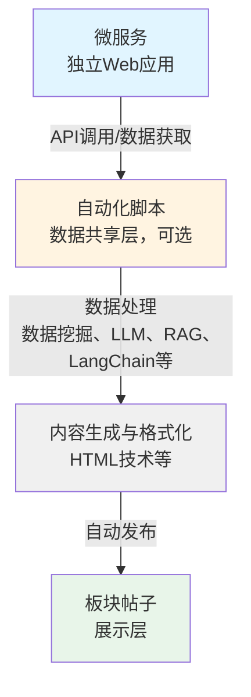

# 数据共享

## 概述

微服务内容可以选择在本站进行数据共享，让更多学生了解和使用您的微服务，提高微服务的使用数。您也可以开发自动化脚本（Agent，自动发布帖子程序）来实现自动化的数据共享。

## 数据流设计

### 微服务-自动化脚本-板块帖子的数据流

自动化脚本在微服务和平台之间起到数据共享层的作用，数据流设计如下：

**数据流说明**：
1. **数据获取**：自动化脚本从微服务 API、网页、数据库等数据源获取数据
2. **数据处理**：使用数据挖掘、LLM、RAG、LangChain 等技术处理数据
3. **内容生成**：生成帖子内容，可以使用 HTML 技术优化展示
4. **自动发布**：通过平台 API 发布到指定板块

**共享机制**：
- 微服务可以独立运行，提供 Web 应用服务
- 自动化脚本作为可选的数据共享层，将微服务内容集成到平台
- 板块作为展示层，展示自动化脚本发布的内容
- 板块一般与微服务对应，但这种对应关系不是必须的

**技术能力**：
自动化脚本可以结合大模型、RAG、LangChain、数据挖掘、HTML等技术，实现适配平台的智能服务。

## 共享方式

### 1. 新建板块

为您的微服务创建专门的板块，集中展示微服务相关内容。板块一般与微服务对应，但这种对应关系不是必须的。

**适用场景**：
- 微服务内容较多，需要独立展示
- 希望建立微服务的专门社区
- 需要分类管理不同类型的内容

### 2. 在已有板块下发布帖子

在现有的相关板块下发布帖子，展示微服务内容。

**适用场景**：
- 内容较少，适合在现有板块展示
- 希望与现有内容形成互动
- 快速上线和展示

## 帖子格式

### 普通文本帖子

标准的文本格式帖子，支持：

- 文本内容
- 图片（使用 `[图片URL]` 格式）
- 链接识别和渲染
- 关联项目（使用 `#/{type}/{id}` 格式）

详细的帖子格式说明请查看平台适配开发指南。

### HTML 帖子

可以自定义 HTML 样式，优化展示效果。

**格式**：帖子内容以 `SELF-DEFINE-HTML` 开头，后跟 HTML 内容。

**特点**：
- 完全自定义的 HTML 样式
- 在 iframe 中渲染，保证安全隔离
- 支持交互功能（需注意安全限制）

**设计建议**：
- 自定义样式、函数等统一添加用户名作为前缀，避免冲突
- 避免使用攻击性代码
- PC 端最佳宽度 700px，移动端最佳宽度 98vw
- 样式过宽会采用滚动条，过窄会自动居中

详细的帖子格式说明请查看平台适配开发指南。

## 账号配置

### 发布账号

微服务内容的发布需要一个账号作为发布者：

- **新建账号**：可以为本微服务创建专门的发布账号
- **使用已有账号**：也可以使用已经注册的账号

### 账号管理

- 账号由开发者管理
- 确保账号安全，避免泄露
- 定期更新发布内容

## API 文档

### 获取方式

数据共享和帖子发布相关的 API 文档需要联系管理员获取：

- **管理员邮箱**：admin@sharesdu.com
- **QQ群**：246680702

### 文档内容

API 文档将包含：

- 板块创建接口
- 帖子发布接口
- 帖子格式规范
- 错误处理说明
- 示例代码

## 开发建议

### 内容规划

1. **内容类型**：规划要发布的内容类型和频率
2. **更新策略**：制定内容更新策略
3. **用户互动**：考虑如何与用户互动

### 技术实现

1. **自动化发布**：可以开发自动化脚本（Agent，自动发布帖子程序）定期发布内容
   - 自动化脚本可以结合大模型、RAG、LangChain、数据挖掘、HTML等技术
   - 实现智能化的内容生成和处理
2. **数据同步**：确保微服务数据与本站内容同步
3. **错误处理**：实现完善的错误处理和重试机制

### 自动化脚本开发

如果您想开发自动化脚本来实现数据共享，可以参考以下流程：

1. **开发微服务**：先开发微服务，提供独立的 Web 应用
2. **选择板块**：选择对应的板块（可以与微服务对应，但不是必须的）
3. **开发自动化脚本**：开发自动化脚本，调用微服务 API，使用大模型、RAG、LangChain、数据挖掘等技术处理，使用 HTML 技术优化展示，自动发布到板块
4. **数据生命周期管理**：对于实时性强的服务，实现自动删除过时内容的机制

详细内容请参考自动化脚本开发相关文档。

### 样式设计

如果使用 HTML 帖子：

1. **响应式设计**：考虑 PC 端和移动端的显示效果
2. **性能优化**：优化 HTML 内容，避免影响页面加载
3. **安全考虑**：避免使用可能造成安全问题的代码

## 注意事项

1. **内容规范**：发布的内容需符合平台规范
2. **更新频率**：合理控制内容更新频率，避免过度发布
3. **用户反馈**：关注用户反馈，及时调整内容策略
4. **数据同步**：确保微服务数据与发布内容的一致性

## 相关文档

- **自动化脚本开发**：了解如何开发自动化脚本实现数据共享
- **平台适配开发指南**：了解帖子格式和内容解析逻辑

## 联系获取文档

数据共享和帖子发布相关的详细 API 文档和规范说明需要联系管理员获取最新版本。