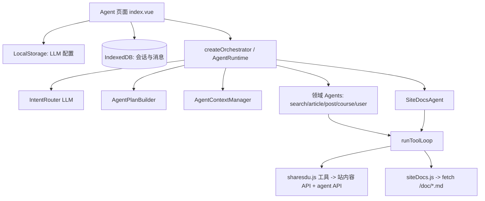

## 1. 产品定位

**ShareSdu 站内智能助手**：在浏览器端通过用户自配的 **OpenAI 兼容 Chat API** 驱动，在 **只读** 前提下检索站内课程/文章/帖子/用户等数据，并回答本站说明、政策与开发者文档类问题。  
不执行创建、编辑、删除、发布等写操作；站外泛知识类问题被归类为 `off_topic` 并简短转介。

---

## 2. 总体架构

- **编排层**：`orchestrator.js` 暴露 `createOrchestrator()`，内部是 `AgentRuntime.handle()`（见 `runtime/agentRuntime.js`）。
- **执行层**：各 Agent 复用 `runToolLoop`：多次调用 LLM，直到无 `tool_calls` 或达 `maxRounds`。
- **数据层**：工具实现调现有 `@/api/modules/*`；本站文档用 `public/doc` 的 Markdown（`tools/siteDocs.js`）。

---

## 3. 请求处理管线（`AgentRuntime`）

1. **构建上下文**：`AgentContextManager.buildInputContext` 从对话历史截断出最近 N 轮（`contextTurns`），并可选注入「结构化会话记忆」`system` 消息。  
2. **意图与领域路由**：`runIntentRouter` 单独一次 LLM 调用，要求只输出 JSON：`intents`（`site_query` / `site_docs` / `off_topic` 可多选）+ 若有 `site_query` 则 `domain`（`course` | `article` | `post` | `user` | `search`）。解析失败或异常时兜底为 `site_query` + `search`（`intentRouterAgent.js`）。  
3. **计划**：`AgentPlanBuilder.build` 根据意图和领域生成 `plan`（目标文案、工具优先级、兜底链、课程域枚举提示、文档焦点 `doc_focus` 等）。  
4. **分支执行**：  
   - 仅 `off_topic` 且无 `site_docs`/`site_query`：固定短回复，不调用子 Agent。  
   - 含 `site_docs`：跑 `SiteDocsAgent`（文档工具集）。  
   - 含 `site_query`：按 `plan.domain` 选 `domainAgents[domain]`，默认有 `search` 等；失败时若 `errorPolicy.shouldFallbackToSearch` 为真则回退到 `search`（`agentRuntime.js` 104–160 行附近逻辑）。  
5. **合并输出**：多段（本站说明 + 站内查询）用 `## 标题` 拼成一条 Markdown 助手消息。  
6. **会话状态回写**：`contextManager.updateSessionState` 更新 `AgentSessionState`（摘要、最近问答、备注 bump 等）。

事件流通过 `onEvent` 向 UI 透出（协议见 `protocol.js` 中 `EVENT_TYPES` 等），供「思考过程」树展示。

---

## 4. 领域 Agent 与工具（`agents/domainAgents.js` + `tools/sharesdu.js`）

- **五类能力**：`search`、`article`、`post`、`course`、`user`，每类有 **不同 tool 子集**（`pickTools` 从 `SHARES_DU_TOOLSET` 选取）。  
- **系统提示**（`baseSystem`）：强调只读、优先用对话历史、多关键词与粗搜再精查、禁编造、站内路由用 `[文本](#/path)` 可点击。课程域额外附枚举说明（`enumNormalizer`）。  
- **运行**：`runToolLoop` 用 OpenAI 兼容 `chat/completions`，`tool_choice: auto`；工具结果以 `role: tool` + JSON 回灌。  
- **工具层**：`sharesdu.js` 将搜索、文章/帖子/课程/用户等 API 包装为 **统一 `{ ok, data?, error? }`**，部分带 `_agent_meta` 供 UI 摘要（`runToolLoop` 的 `toolSummary`）。

`SiteDocsAgent` 独立使用 `SITE_DOCS_TOOLSET`（`get_site_doc` / `get_site_doc_link` 等），与站内业务检索解耦。

---

## 5. 协议与类型（`protocol.js`）

- 领域枚举 `AGENT_DOMAINS`、意图 `INTENT_TYPES`。  
- `parseIntentRouterOutput` / `extractJsonObject`：从 LLM 文本中抠 JSON。  
- 文档中约定 **Tool 返回形状**、**Agent 请求/响应** 的泛型 JSDoc，便于前后端心智一致（运行时多为软校验）。

---

## 6. 会话与记忆

- **内存状态**：`AgentSessionState`（`state/agentSessionState.js`）维护 `last_route`、`last_plan`、`last_error`、`memory`（`notes`/`summary`/实体与筛选等）。  
- **持久化**：`agentChatDb.js` 使用 Dexie，表 `agent_sessions` / `agent_messages`；会话上增加 `agent_state` 与 `agent_state_updated_at`，与聊天消息同库。  
- **结构化记忆如何进模型**：`AgentContextManager.buildMemoryMessage` 把 `toJSON` 状态整理成 `【结构化会话记忆】` 的 `system` 段（可关闭 `structuredMemory`）。  
- **配置**（`config.js`）：`AGENT_LLM_CONFIG_STORAGE_KEY` 存 localStorage，含 `baseUrl`、`apiKey`、`model`、`temperature`、`maxTokens`、`maxRounds`、`contextTurns`、记忆条数上限等；`validateAgentLLMConfig` 要求至少 baseUrl、apiKey、model。

---

## 7. LLM 客户端（`llm/openaiCompatible.js`）

- `createOpenAICompatibleClient`：`fetch` 调 `{baseUrl}/v1/chat/completions`，`Authorization: Bearer {apiKey}`。  
- **密钥不落服务端**：由用户在浏览器配置，与产品文案「网站不提供 Key」一致（页面 `index.vue`）。

---

## 8. 错误与降级（`runtime/errorPolicy.js`）

- `classify`：根据错误文案粗分 auth / rate_limit / network / format / abort 等。  
- `buildUserMessage`：面向用户的简短说明。  
- 站内查询子 Agent 抛错时，非 `search` 领域可 **自动 fallback 到 `search` Agent**。

---

## 9. 页面层（`pages/agent/index.vue`）

- **布局**：侧栏会话列表 + 主区对话；移动端侧栏可叠层。  
- **配置**：`AgentConfigDialog` 绑定 `getAgentLLMConfig` / `setAgentLLMConfig`。  
- **发送**：`createOrchestrator().handle({ cfg, history, userText, signal, sessionState, onEvent })`；`AbortController` 支持「停止」。  
- **过程可视化**：`onEvent` 驱动树形 `process`（意图 → 计划 → 派发 → Agent → LLM 轮次 → 工具起止等），`flattenProcess` 展平展示。  
- **后处理**：`linkifyInternalRoutes` 将裸 `#/...` 等转为 Markdown 链接，与 Agent 系统提示中的链接规范配合。  
- **持久化**：用户/助手消息写入 IndexedDB；结束后 `updateMessageContent` 与 `updateSessionState`。

---

## 10. 关键设计决策（小结）

| 点 | 做法 |
|----|------|
| 多意图 | 路由可返回多个 intent；`site_docs` 与 `site_query` 顺序执行后合并。 |
| 站外问题 | 仅 `off_topic` 时短回复，不耗工具与主检索。 |
| 成本与可控性 | 意图路由用小 `max_tokens`；主循环有 `maxRounds`；历史有 `contextTurns` 截断。 |
| 可观测性 | 统一 `onEvent` 类型，便于 UI 与后续调试。 |
| 隐私 | API Key 仅本地；聊天记录提示「本地」IndexedDB。 |
